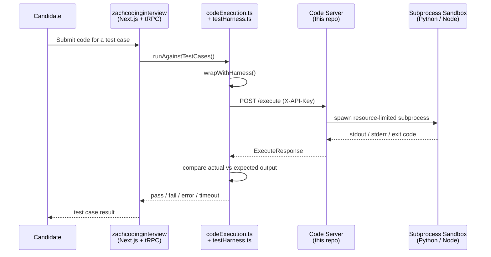

<div align="center">

# ⚙️ ZachCodingInterview - Code Server

### Lightweight Sandboxed Code Execution Service

> Built specifically to power live code execution for **[zachcodinginterview](https://github.com/19akshansh/zachcodinginterview)** - the AI-powered mock interview platform. Every coding interview and practice submission on that platform is run through this service.

<p align="center">
  <a href="https://github.com/19akshansh/zachcodinginterview">Main Project</a>
  ·
  <a href="https://zachcodinginterview.vercel.com">Live App</a>
  ·
  <a href="https://github.com/19akshansh/zachcodinginterview_codeserver/issues">Report Bug</a>
  ·
  <a href="https://github.com/19akshansh/zachcodinginterview_codeserver/issues">Request Feature</a>
</p>

<p align="center">
  
  
  
  
</p>

<p align="center">
  
  
  
  
  
</p>

</div>

---

## 🚀 What is this?

This is the code execution sandbox for [zachcodinginterview](https://github.com/19akshansh/zachcodinginterview). Whenever a candidate submits code during a coding interview or a practice session, the main app sends that code here, this service runs it as a resource-limited subprocess, and returns `stdout`, `stderr`, the exit code, and whether it timed out - which the main app then compares against expected test case output to decide pass/fail.

It intentionally does **not** rely on Docker-in-Docker or privileged containers for isolation. Instead, it uses plain OS-level resource limits (CPU time, memory, process count, open files) on a subprocess. That's weaker isolation than something like Piston, but it's deployable literally anywhere that can run Python - a normal VPS, a free-tier PaaS container, or even directly inside Termux on an Android phone.

## ✨ Features

- **Two runtimes**: Python 3 and Node.js (JavaScript), selected per-request
- **Resource-limited execution** - CPU time, wall-clock time, memory, process count, and open-file limits, all independently tunable via env vars
- **Clean, minimal environment** - no host secrets or env vars leak into candidate code; a small `UV_THREADPOOL_SIZE` keeps Node's thread pool tight
- **Output truncation** - stdout/stderr capped so a runaway `print` loop can't blow up the response
- **API key protected** - every `/execute` call requires an `X-API-Key` header, and the server fails closed if no key is configured
- **Health check endpoint** for uptime monitoring
- **No special container privileges required** - runs fine under restrictive PaaS sandboxes (with the one exception noted below) and even under Termux

## 📡 API

| Endpoint | Method | Description |
|---|---|---|
| `/execute` | `POST` | Runs a code snippet (`language`, `code`, `stdin`) and returns `stdout`, `stderr`, `exit_code`, `timed_out`, `error`. Requires `X-API-Key` header. |
| `/health` | `GET` | Returns server status and which languages are currently supported. |

**`POST /execute` request body:**

```json
{
  "language": "python",
  "code": "print(input())",
  "stdin": "hello"
}
```

**Response:**

```json
{
  "stdout": "hello\n",
  "stderr": "",
  "exit_code": 0,
  "timed_out": false,
  "error": null
}
```

## 🏗️ How it fits into ZachCodingInterview



## 🛠️ Tech Stack

| Layer | Technology |
|---|---|
| Framework | FastAPI |
| Server | Uvicorn (ASGI) |
| Language | Python 3.12 |
| Executable runtimes | Python 3, Node.js 20.x |
| Isolation | OS-level `resource` limits (CPU, memory, processes, open files) |
| Config | `python-dotenv` |
| Containerization | Docker (Debian Bullseye slim base) |

## 🚀 Quick Start

### Clone the repository

```bash
git clone https://github.com/19akshansh/zachcodinginterview_codeserver.git
cd zachcodinginterview_codeserver
```

### Configure environment variables

Copy the example file and set your own API key:

```bash
cp example.env .env
```

Generate a strong API key:

```bash
python3 -c "import secrets; print(secrets.token_hex(32))"
```

### Run locally

```bash
pip install -r requirements.txt
uvicorn app:app --host 0.0.0.0 --port 8000
```

### Run with Docker

```bash
docker build -t zachcodinginterview-codeserver .
docker run -p 8000:8000 --env-file .env zachcodinginterview-codeserver
```

Then point your `zachcodinginterview` deployment's `CODESERVER_API_URL` at wherever this service ends up running, with `CODESERVER_APIKEY` matching the `API_KEY` you set above.

## 🔑 Environment Variables

| Variable | Description | Default |
|---|---|---|
| `API_KEY` | Required secret checked against the `X-API-Key` header on `/execute`. Server refuses to run `/execute` at all if this isn't set. | - |
| `CPU_TIME_LIMIT_SECONDS` | Max CPU time per execution | `3` |
| `WALL_TIME_LIMIT_SECONDS` | Max wall-clock time per execution | `5` |
| `MEMORY_LIMIT_MB` | Max memory per execution (Python only - see limitations) | `200` |
| `MAX_PROCESSES` | Max number of processes/threads the sandboxed code can spawn | `64` (`20` in `example.env`) |
| `MAX_OPEN_FILES` | Max open file descriptors | `64` |
| `MAX_OUTPUT_BYTES` | Max combined stdout/stderr size before truncation | `100000` |

## ⚠️ Known Limitations

This is a lightweight subprocess sandbox, **not** a hardened, container-per-execution sandbox like Piston or Judge0. Keep this in mind before relying on it for anonymous, unproctored, fully adversarial users:

- Isolation is enforced via `resource` limits and a clean environment, not per-execution containers or VMs.
- Memory limits (`RLIMIT_AS`) are only applied to Python. Node/V8 reserves a large chunk of virtual address space at startup regardless of actual heap usage, so a hard `RLIMIT_AS` would kill the process before it runs - Node's memory is instead bounded with `--max-old-space-size` on the command itself.
- Runs through Termux on my phone so might have bad uptime ;-;

## 📂 Project Structure

```text
zachcodinginterview_codeserver/
├── app.py              # FastAPI app - /execute and /health
├── requirements.txt    # fastapi, uvicorn, pydantic, python-dotenv
├── Dockerfile           # Debian Bullseye slim + Python 3.12 + Node.js 20.x
├── example.env          # copy to .env and fill in your API key + limits
└── .gitignore
```

## 🤝 Contributing

Contributions are welcome.

1. Fork the repository
2. Create a new branch (`git checkout -b feat/my-feature`)
3. Commit your changes
4. Open a pull request

## 📜 License

Licensed under the MIT License, same as the main [zachcodinginterview](https://github.com/19akshansh/zachcodinginterview) project.

---

<div align="center">

### Built to run code for zachcodinginterview

If this code server helps you, consider giving the repo a ⭐

</div>
